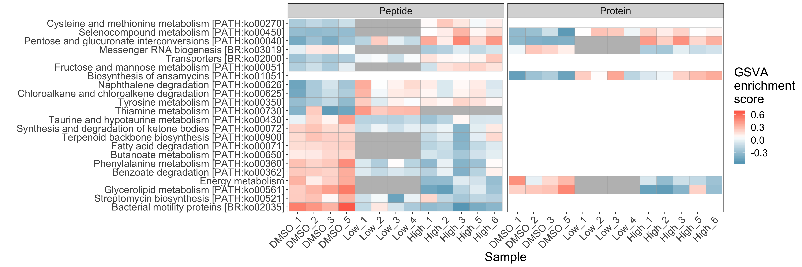

# An example of how I create reproducible figures

These are a few figures I made for the [pepFunk](https://shiny.imetalab.ca/pepFunk/) manuscript. 
This manuscript is currently in revision with Bioinformatics, but you can access the [preprint](https://www.biorxiv.org/content/10.1101/854976v1)

If you use the app or the methodology please cite our preprint as:
pepFunk, a tool for peptide-centric functional analysis in metaproteomic human gut microbiome studies
Caitlin M.A. Simopoulos, Zhibin Ning, Xu Zhang, Leyuan Li, Krystal Walker, Mathieu Lavallée-Adam, Daniel Figeys.
bioRxiv 854976; doi: https://doi.org/10.1101/854976

## Directory setup

- `data`: contains all the data needed to **create the figures**
  - Note: This repository **does not contain raw data** (I cheated!). 
- `figs`: contains the figures created by our script and the figures in the presentation
- `presentation`: contains all TeX files required to compile the Beamer presentation
- `scripts`: contains R scripts for data analysis and figure creation

## How to run the scripts

`reproducible_figs.R` contains all functions required to create the figures. If you'd like, you can play around with the options. The script will save `.pdf` versions of the figures in the `figs` directory.

**Note**: You will need to set your own working directory on line 12.

## Figures produced by this code:




## R session info

Output from my R session that contains R and package versions (using `sessionInfo()`):

```
R version 3.6.2 (2019-12-12)
Platform: x86_64-apple-darwin18.7.0 (64-bit)
Running under: macOS Catalina 10.15.2

Matrix products: default
BLAS:   /System/Library/Frameworks/Accelerate.framework/Versions/A/Frameworks/vecLib.framework/Versions/A/libBLAS.dylib
LAPACK: /usr/local/Cellar/openblas/0.3.7/lib/libopenblasp-r0.3.7.dylib

locale:
[1] en_CA.UTF-8/en_CA.UTF-8/en_CA.UTF-8/C/en_CA.UTF-8/en_CA.UTF-8

attached base packages:
[1] stats     graphics  grDevices utils     datasets  methods   base     

other attached packages:
 [1] ggpubr_0.2.3    magrittr_1.5    forcats_0.4.0   stringr_1.4.0   dplyr_0.8.3     purrr_0.3.2    
 [7] readr_1.3.1     tidyr_1.0.0     tibble_2.1.3    ggplot2_3.2.1   tidyverse_1.2.1

loaded via a namespace (and not attached):
 [1] Rcpp_1.0.3       cellranger_1.1.0 pillar_1.4.3     compiler_3.6.2   plyr_1.8.5       tools_3.6.2     
 [7] digest_0.6.23    zeallot_0.1.0    lubridate_1.7.4  jsonlite_1.6     lifecycle_0.1.0  nlme_3.1-142    
[13] gtable_0.3.0     lattice_0.20-38  pkgconfig_2.0.3  rlang_0.4.2      cli_2.0.1        rstudioapi_0.10 
[19] haven_2.1.1      withr_2.1.2      xml2_1.2.2       httr_1.4.1       generics_0.0.2   vctrs_0.2.1     
[25] hms_0.5.1        grid_3.6.2       tidyselect_0.2.5 glue_1.3.1       R6_2.4.1         fansi_0.4.1     
[31] readxl_1.3.1     farver_2.0.3     modelr_0.1.5     reshape2_1.4.3   backports_1.1.5  scales_1.1.0    
[37] rvest_0.3.4      assertthat_0.2.1 colorspace_1.4-1 ggsignif_0.6.0   labeling_0.3     stringi_1.4.3   
[43] lazyeval_0.2.2   munsell_0.5.0    broom_0.5.2      crayon_1.3.4   
```
